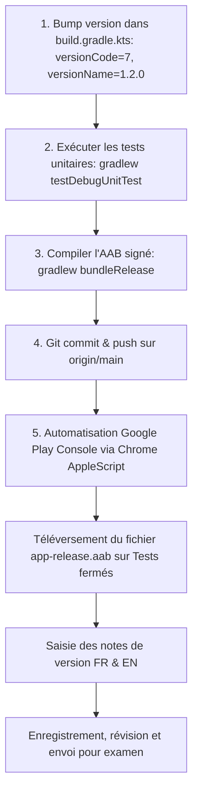

# Plan d'implémentation - Livraison de la version 1.2.0 en Test Fermé sur Google Play Console

> **For agentic workers:** REQUIRED SUB-SKILL: Use superpowers:subagent-driven-development or superpowers:executing-plans to implement this plan task-by-task. Steps use checkbox (`- [ ]`) syntax for tracking.

**Goal:** Incrémenter la version de l'application ClipMemo à `1.2.0` (versionCode `7`), compiler le bundle de production signé (`app-release.aab`), committer et pusher les changements sur `main`, puis publier la release sur le canal **Tests fermés - Alpha** du **Google Play Console**.

---

## 1. Contexte & Contenu de la Version 1.2.0

Cette release `1.2.0` regroupe toutes les améliorations majeures récemment développées et validées sur émulateur :
1. **Redirection automatique vers l'accueil** : dès qu'un Reel Instagram est partagé dans ClipMemo depuis un écran secondaire (ex: Paramètres), l'application bascule automatiquement sur l'écran d'accueil avec son overlay de chargement.
2. **Popin de bienvenue au 1er lancement** : dialogue modal d'onboarding présentant l'application et rappelant que la connexion Instagram est 100% optionnelle (avec action directe pour se connecter ou démarrer).
3. **Détection automatique de la langue système** : détection de la langue de l'appareil (Français pour les francophones, Anglais par défaut pour les anglophones et l'international).
4. **Internationalisation complète** : traduction intégrale en français et en anglais (`res/values/strings.xml` et `res/values-en/strings.xml`), incluant le dialogue de connexion Instagram.

---

## 2. Architecture de la Livraison



---

## 3. Paramètres de Release

- **Identifiant application** : `com.danstudios.clipmemo`
- **Track Play Console** : **Tests fermés** (Canal *Alpha* - `tracks/4699452985724409482`)
- **Version Code** : `7` (précédent `6`)
- **Version Name** : `"1.2.0"` (précédent `"1.1.1"`)
- **Keystore de signature** : `app/release.keystore` (alias: `clipmemo`, mot de passe configuré)

### Notes de version (Release Notes)

#### En Français (`fr-FR`) :
```text
Nouveautés de la version 1.2.0 :
- Accueil & Onboarding : affichage au premier lancement d'un message d'accueil expliquant le fonctionnement de l'application et le caractère optionnel de la connexion Instagram.
- Support multilingue automatique : détection automatique de la langue du système (français pour les francophones, anglais pour les anglophones et l'international).
- Navigation fluide : redirection automatique vers l'écran d'accueil dès qu'un Reel est partagé vers ClipMemo.
- Localisation complète : traduction intégrale de la boîte de dialogue de connexion Instagram.
- Améliorations de stabilité et performances générales.
```

#### En Anglais (`en-US`) :
```text
What's new in version 1.2.0:
- Welcome Onboarding: first-launch modal explaining how the app works and clarifying that Instagram login is 100% optional.
- Automatic multilingual support: system language detection (French for francophone users, English for anglophone & international users).
- Seamless navigation: automatic redirection to the home screen as soon as a Reel is shared into ClipMemo.
- Full localization: complete English and French support for the Instagram login dialog.
- General stability and performance improvements.
```

---

## 4. Proposed Changes

### Configuration Layer

#### [MODIFY] [`app/build.gradle.kts`](file:///Users/nabil/dev/clipmemo/app/build.gradle.kts)
- Mettre à jour `versionCode` à `7` et `versionName` à `"1.2.0"` :
```kotlin
    defaultConfig {
        applicationId = "com.danstudios.clipmemo"
        minSdk = 26
        targetSdk = 36
        versionCode = 7
        versionName = "1.2.0"
```

---

## 5. Plan Tasks

### Task 1: Version Bump & Verification
**Files:**
- Modify: `app/build.gradle.kts`

- [ ] **Step 1: Bump versionCode to 7 and versionName to "1.2.0" in `app/build.gradle.kts`**
- [ ] **Step 2: Run all unit tests to ensure stability**
  - Command: `./gradlew testDebugUnitTest`
- [ ] **Step 3: Generate signed Android App Bundle (AAB)**
  - Command: `./gradlew bundleRelease`
  - Output: `app/build/outputs/bundle/release/app-release.aab`
- [ ] **Step 4: Commit and push changes to remote**
  - Command: `git commit -am "chore(release): bump version to 1.2.0 (7) for closed testing release" && git push origin main`

### Task 2: Upload & Submit on Google Play Console (Closed Testing)
**Tools:** AppleScript Google Chrome Automation

- [ ] **Step 1: Navigate Chrome to Closed Testing track (Alpha)**
  - URL: `https://play.google.com/console/u/0/developers/8256275473535406544/app/4976119191217236983/tracks/4699452985724409482`
- [ ] **Step 2: Click "Créer une release" / Create Release**
- [ ] **Step 3: Upload the signed bundle `app/build/outputs/bundle/release/app-release.aab`**
- [ ] **Step 4: Enter version name "1.2.0" and release notes (FR & EN)**
- [ ] **Step 5: Click "Suivant", review warnings, and submit the release for review**
- [ ] **Step 6: Capture screenshot of the confirmation page and update walkthrough**

---

## 6. Verification Plan

### Automated Tests
```bash
./gradlew testDebugUnitTest
./gradlew bundleRelease
```

### Play Console Delivery Verification
1. Vérification que l'AAB `app-release.aab` est bien accepté avec le versionCode `7` et versionName `1.2.0`.
2. Vérification que la version apparaît dans la liste des releases des **Tests fermés** avec le statut "En cours d'examen" ou "Prêt pour examen".
3. Capture d'écran de confirmation enregistrée dans les artefacts.
