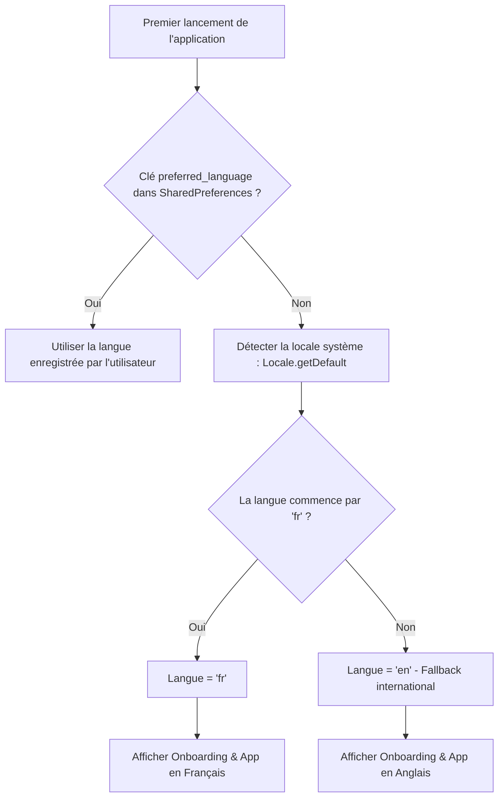

# Plan d'implémentation - Détection automatique de la langue système au 1er lancement (Support Anglophone)

> **For agentic workers:** REQUIRED SUB-SKILL: Use superpowers:subagent-driven-development or superpowers:executing-plans to implement this plan task-by-task. Steps use checkbox (`- [ ]`) syntax for tracking.

**Goal:** Permettre aux utilisateurs anglophones (et internationaux) de lire le message d'accueil (popin d'onboarding) ainsi que l'ensemble de l'application directement en anglais dès la première ouverture, tout en conservant le français pour les utilisateurs francophones et le choix manuel dans les Paramètres.

---

## 1. Contexte & Diagnostic du Problème

### Diagnostic
Actuellement, **NON**, un utilisateur anglophone qui installe l'application ClipMemo pour la première fois **ne voit pas** la popin en anglais :
1. Dans [`PreferencesManager.kt`](file:///Users/nabil/dev/clipmemo/app/src/main/java/com/danstudios/reelnotes/data/local/PreferencesManager.kt#L10-L14) :
   ```kotlin
   open var preferredLanguage: String
       get() = prefs?.getString(KEY_PREFERRED_LANGUAGE, "fr") ?: "fr"
   ```
   La valeur de repli est codée en dur à `"fr"`.
2. Au tout premier lancement, aucune clé `preferred_language` n'existe dans `SharedPreferences`.
3. L'application charge donc `"fr"`, et [`MainActivity.kt`](file:///Users/nabil/dev/clipmemo/app/src/main/java/com/danstudios/reelnotes/MainActivity.kt#L55-L77) force `Locale.FRENCH` via `CompositionLocalProvider`.
4. La popin d'accueil s'affiche alors en français ("Bienvenue sur ClipMemo", "C'est parti !"), même si l'appareil Android de l'utilisateur est configuré en anglais (`en-US` ou `en-GB`).
5. De plus, dans [`InstagramLoginDialog.kt`](file:///Users/nabil/dev/clipmemo/app/src/main/java/com/danstudios/reelnotes/ui/components/InstagramLoginDialog.kt#L68-L79), les libellés de l'en-tête sont codés en dur en français ("Connexion Instagram", "Fermer").

---

## 2. Architecture de la Solution



1. **Détection intelligente de la langue système (`PreferencesManager`) :**
   - Si `KEY_PREFERRED_LANGUAGE` n'est pas présent dans `SharedPreferences` : inspecter `Locale.getDefault().language`.
   - Si la langue système est francophone (`fr`) -> `"fr"`.
   - Pour toute autre langue (anglophone `en`, ou autre langue internationale) -> `"en"`.
   - Dès que l'utilisateur modifie manuellement la langue dans l'écran des Paramètres, la valeur est sauvegardée et prioritaire.
2. **Internationalisation de `InstagramLoginDialog` :**
   - Extraire les chaînes codées en dur ("Connexion Instagram", sous-titre de déblocage, "Fermer") vers `res/values/strings.xml` et `res/values-en/strings.xml`.
   - Appliquer `CompositionLocalProvider` dans `InstagramLoginDialog` pour respecter la locale active de l'application.
3. **Tests automatisés :**
   - Tests unitaires couvrant la détection par défaut de la locale système (`en` vs `fr`) et la persistance de l'override utilisateur.

---

## 3. User Review Required

> [!IMPORTANT]
> - Les utilisateurs dont le téléphone est en anglais (ou dans une autre langue internationale comme l'espagnol ou l'allemand) recevront désormais automatiquement ClipMemo et son onboarding en **anglais**.
> - Les utilisateurs dont le téléphone est en français recevront ClipMemo et son onboarding en **français**.
> - L'utilisateur peut à tout moment changer ce réglage dans l'onglet **Paramètres / Settings**.

---

## 4. Proposed Changes

### Layer 1: Data & Preferences Layer

#### [MODIFY] [`app/src/main/java/com/danstudios/reelnotes/data/local/PreferencesManager.kt`](file:///Users/nabil/dev/clipmemo/app/src/main/java/com/danstudios/reelnotes/data/local/PreferencesManager.kt)

- Mettre à jour `preferredLanguage` pour détecter la langue du système par défaut :
```kotlin
open var preferredLanguage: String
    get() = prefs?.getString(KEY_PREFERRED_LANGUAGE, null) ?: getDefaultLanguage()
    set(value) {
        prefs?.edit()?.putString(KEY_PREFERRED_LANGUAGE, value)?.apply()
    }

open fun getDefaultLanguage(): String {
    val systemLang = java.util.Locale.getDefault().language
    return if (systemLang.startsWith("fr", ignoreCase = true)) "fr" else "en"
}
```

---

### Layer 2: String Resources Layer

#### [MODIFY] [`app/src/main/res/values/strings.xml`](file:///Users/nabil/dev/clipmemo/app/src/main/res/values/strings.xml)
- Ajouter les clés de localisation pour `InstagramLoginDialog` :
```xml
    <!-- Instagram Login Dialog -->
    <string name="instagram_login_title">Connexion Instagram</string>
    <string name="instagram_login_subtitle">Connectez-vous pour débloquer les Reels soumis à restriction.</string>
    <string name="btn_close">Fermer</string>
```

#### [MODIFY] [`app/src/main/res/values-en/strings.xml`](file:///Users/nabil/dev/clipmemo/app/src/main/res/values-en/strings.xml)
- Ajouter les équivalents anglais :
```xml
    <!-- Instagram Login Dialog -->
    <string name="instagram_login_title">Instagram Login</string>
    <string name="instagram_login_subtitle">Log in to unlock restricted or private Reels.</string>
    <string name="btn_close">Close</string>
```

---

### Layer 3: UI Layer

#### [MODIFY] [`app/src/main/java/com/danstudios/reelnotes/ui/components/InstagramLoginDialog.kt`](file:///Users/nabil/dev/clipmemo/app/src/main/java/com/danstudios/reelnotes/ui/components/InstagramLoginDialog.kt)
- Remplacer les chaînes littérales par `stringResource(R.string.instagram_login_title)`, `stringResource(R.string.instagram_login_subtitle)`, et `stringResource(R.string.btn_close)`.
- Envelopper le contenu de la `Surface` dans `CompositionLocalProvider(LocalContext provides context, LocalConfiguration provides configuration)` pour garantir la cohérence linguistique avec le reste de l'application.

---

### Layer 4: Unit Tests Layer

#### [NEW] [`app/src/test/java/com/danstudios/reelnotes/data/local/PreferencesManagerLanguageTest.kt`](file:///Users/nabil/dev/clipmemo/app/src/test/java/com/danstudios/reelnotes/data/local/PreferencesManagerLanguageTest.kt)
- Vérifier que `getDefaultLanguage()` retourne `"fr"` quand la locale est `Locale.FRENCH` ou `Locale("fr", "CA")`.
- Vérifier que `getDefaultLanguage()` retourne `"en"` quand la locale est `Locale.ENGLISH` ou `Locale.US`.
- Vérifier que `getDefaultLanguage()` retourne `"en"` pour toute autre locale (ex: `Locale.GERMAN`).
- Vérifier qu'une préférence explicite enregistrée a toujours priorité sur la locale système.

---

## 5. Plan Tasks

### Task 1: Preferences Default Language Detection & Unit Tests (TDD)
**Files:**
- Modify: `app/src/main/java/com/danstudios/reelnotes/data/local/PreferencesManager.kt`
- Create: `app/src/test/java/com/danstudios/reelnotes/data/local/PreferencesManagerLanguageTest.kt`

- [x] **Step 1: Write unit tests for system language detection and manual override in `PreferencesManagerLanguageTest.kt`**
- [x] **Step 2: Run unit tests to observe RED failure**
  - Command: `./gradlew testDebugUnitTest --tests "*.PreferencesManagerLanguageTest"`
- [x] **Step 3: Update `PreferencesManager.kt` with `getDefaultLanguage()`**
- [x] **Step 4: Run unit tests to verify GREEN**
  - Command: `./gradlew testDebugUnitTest --tests "*.PreferencesManagerLanguageTest"`
- [x] **Step 5: Commit changes**
  - Command: `git commit -m "feat(i18n): detect system language as default in PreferencesManager"`

### Task 2: Localize InstagramLoginDialog
**Files:**
- Modify: `app/src/main/res/values/strings.xml`
- Modify: `app/src/main/res/values-en/strings.xml`
- Modify: `app/src/main/java/com/danstudios/reelnotes/ui/components/InstagramLoginDialog.kt`

- [x] **Step 1: Add strings for InstagramLoginDialog in French and English**
- [x] **Step 2: Replace hardcoded strings in `InstagramLoginDialog.kt` and bind CompositionLocalProvider**
- [x] **Step 3: Run `./gradlew compileDebugKotlin` and `./gradlew testDebugUnitTest`**
- [x] **Step 4: Commit changes**
  - Command: `git commit -m "feat(ui): localize InstagramLoginDialog strings in French and English"`

### Task 3: Emulator Verification (First Launch in English)
- [x] **Step 1: Build and deploy debug APK: `./gradlew installDebug`**
- [x] **Step 2: Clear app data on emulator: `adb shell pm clear com.danstudios.clipmemo.debug`**
- [x] **Step 3: Launch app: `adb shell am start -n com.danstudios.clipmemo.debug/com.danstudios.reelnotes.MainActivity`**
- [x] **Step 4: Verify screenshot shows English onboarding ("Welcome to ClipMemo", "Get Started", "Connect Instagram") on first launch**
- [x] **Step 5: Verify clicking "Connect Instagram" opens the login dialog with English title and "Close" button**
- [x] **Step 6: Update walkthrough and push to remote**

---

## 6. Verification Plan

### Automated Tests
```bash
./gradlew testDebugUnitTest
```

### Manual Verification on Android Emulator
1. Réinitialiser les données de l'application :
   ```bash
   adb shell pm clear com.danstudios.clipmemo.debug
   ```
2. Lancer l'application sur l'émulateur dont l'OS est en anglais (`en-US`).
3. **Résultat attendu :**
   - La popin de bienvenue s'affiche immédiatement en **anglais** : "Welcome to ClipMemo", "Turn Instagram Reels into clean, organized notes in seconds.", boutons "Get Started" et "Connect Instagram".
   - L'écran d'accueil en arrière-plan affiche les libellés en anglais ("All", "Notes", "Favorites", "Settings").
   - Cliquer sur "Connect Instagram" affiche "Instagram Login" et le bouton "Close".
